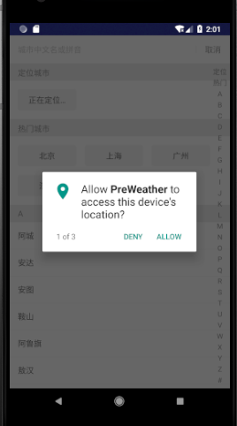

# WeatherForcast
a small weather forecast application.

The MVC structure of the app is illustrated as follow:

The home page looks like this:

And the detailed information of weather is displayed as this:

setting page and share:

The app can also automatically adjusted to a tablet, changing to master-detail user interface.

You can also change your city or locate where you are to see the weather of a specific location.

# Bug
1. The weather data can be stored more than once, may causing repeated weather cell.
3. There is a little problem of locating city.

